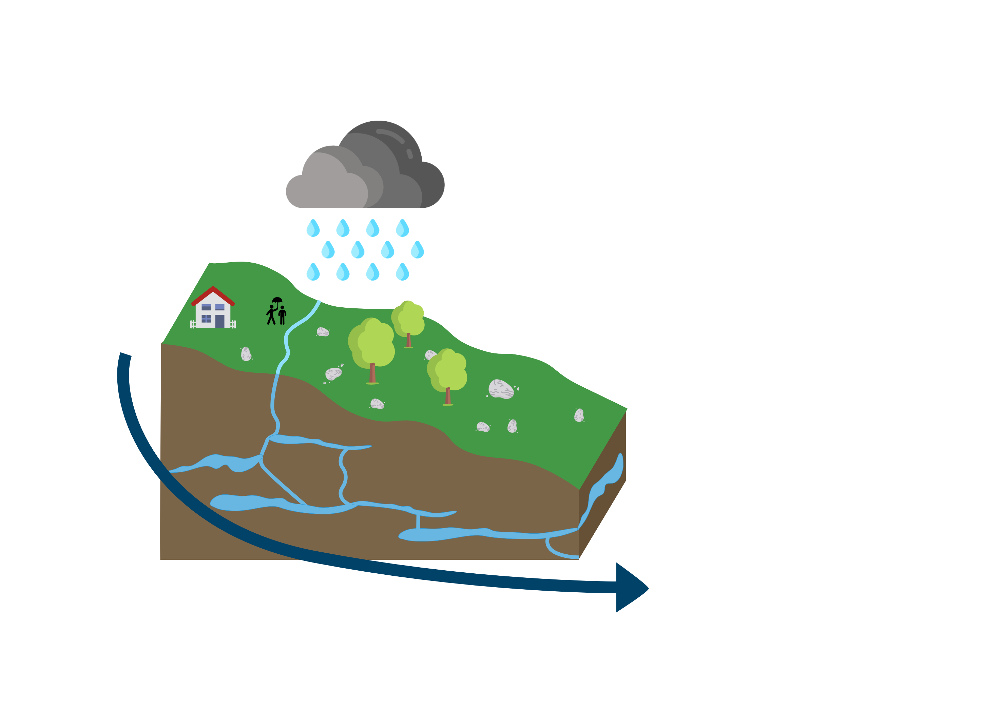

Où ? 
===

Résidez vous dans une zone sensible aux sécheresses? Pour le savoir, prenez connaissance du monde sous vos pieds !   

Votre environnemment est sensible aux sécheresses si : 
1. il y a du relief du type calcaire compact
2. il n'y a pas de vastes réserves d'eau sous-terraines 

>d'autres mécanismes peuvent mener à un faible stockage de l'eau. Pour l'instant, nous nous intéressons seulement à celui-ci. 

Voici les conséquences en image  :

Pluie | Sécheresse
--------- | --------
 | 

## 1. Du relief de type calcaire compact 

Ils sont **en violet**.

En hydrogéologie, ces ensembles rocheux sont nommés: "[formations karstiques plissées](http://www.rhone-mediterranee.eaufrance.fr/milieux-aquatiques/eaux-souterraines/formations-geologiques/calcaires.php)".  

## 2. Pas de réserve d'eau sous-terraine

Selon la profondeur du calcaire, il y a plus ou moins de chances que des réserves d'eau existent.  
Pour le savoir :

* Utilisez le [visualisateur des acteurs de l'eau en France, BDLisa](http://bdlisa.eaufrance.fr). 
* Sélectionnez la couche "entités ou secteurs karstiques".  

Êtes vous localisé sur une zone en **bleu clair** ou en **bleu foncé** ?   

Les zones en **bleu clair** sont particulièrement sensibles aux sécheresses : le calcaire est *affleurant* = en surface. Les couches peuvent faire plusieurs dizaines à centaines de mètres.  

Les zones en **bleu foncé** le sont moins : le calcaire est sous une couche imperméable (qui n'est pas du calcaire). Si la zone est vaste (plusieurs kilomètres carrés), elle peut s'évérer être une réserve d'eau sous-terraine conséquente.  Ou pas. Pour plus de précision, il faut s'adresser aux spécialistes de votre commune (tuto à venir). 

 

*Source: BDlisa*

**Vous réunissez ces deux critères ?** (calcaire compact + peu de chances d'avoir de grandes réserves d'eau sous-terraines)

Vos ressources en eau sont sûrement impactées fortement par les sécheresses. Pour connaître les périodes de sécheresse : [Prochaine étape du tutoriel: votre commune risque t-elle des sécheresses intenses aujourd'hui et à l'avenir?](indice-sswi)

