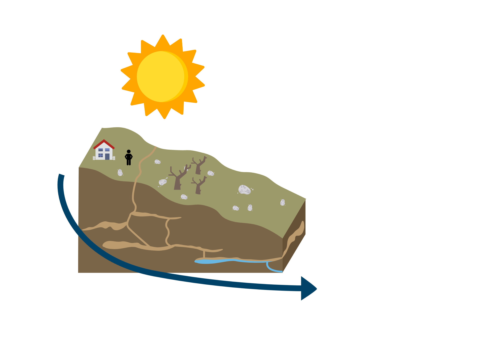

# Des pénuries ? 

##  ⛰️ Dans le Doubs 
> Massif du Jura, département du Doubs, automne 2018.
Les municipalités en rouge ont été ravitaillées par camion citerne, celles en orange ont réussi à se brancher sur des réserves d'autres municipalités, les jaunes sont en tension.  

  

*Source: Préfecture du Doubs*  

La situation est critique aussi pour d'autres municipalités dans les Alpes, Languedoc, ...   

## Pourquoi ?
Ces municipalités puisent l'eau potable sous-terre. Cependant, l'eau n'y est pas retenue longtemps, car sont des zones de **relief** à roches **calcaire**. Voici le phénomène en image : 

## A l'avenir ? 

Il est prévu une hausse des températures moyennes d'environ 2° d'ici 30 ans, et la fiabilité est bonne.  

Quel impact de la hausse des températures ? 
* 🌩Phénomènes orageux : la pluie tombe "d'un coup". Les périodes sans pluie sont plus longues, et au total, moins d'eau s'infiltre dans le sol.
* 🌫 Evaporation
* 🥛 Augmentation du besoin en eau des plantes : Lorsque l'air est trop sec, les plantes utilisent plus d'eau au sol (de nombreux arbres peuvent boire 300L d'eau par jour !)

La hausse des températures peut amener une **réduction des stocks d'eau sous-terrains**.  

> Dès que le sol et la flore sont impactés par le manque d'eau, on parle de [sécheresse](https://www.futura-sciences.com/planete/definitions/meteorologie-secheresse-6527/). Si les réserves d'eau sous-terraines se réduisent, on parle de sécheresse *hydrologique* . 

> Sources : GIEC, météofrance... ( à préciser )

# Evaluer le risque

Vous pouvez évaluer le risque de pénurie d'eau potable dans votre commune (ou ailleurs) : 

OU | QUAND | COMMENT
 ------------ | ------------- | -------------
[Où résidez-vous ? Y a t-il des grandes réserves d'eau ?](../eau-geologie-karstique) |Quand sont prévues des sécheresses ? Quelle sera leur durée et leur intensité ? | Comment votre commune est alimentée en eau actuellement, est-ce des sources durables et suffisantes pour votre utilisation ? 

## [OU](../eau-geologie-karstique)
 
Résidez-vous sur une zone en violet en-dessous ? 

Si oui consultez le tutoriel [en cliquant ici](../eau-geologie-karstique), seule une partie de ces zones est concernée. 

**Pourquoi est-ce que je suis concerné ? **

 Image | Explication
------------ | -------------
 | L'eau de pluie s'infiltre rapidement dans le sous-sol.  
 | Lors de sécheresses, l'eau s'évacue vers les plaines. Jusqu'à 30 mètres par jour ! 
 | Il faut utiliser d'autres sources d'eau (Châteaux d'eau ? Aides de communes voisines, nouveaux forages ..? )

## 2 / [votre commune risque t-elle des sécheresses conséquentes aujourd'hui et à l'avenir?](../indice-sswi)
---

Vous allez pouvoir découvrir pour votre territoire sur les années 2030-2040, 2050-2060, 2070-2080
* la durée des sécheresses moyennes (avec les mois de début et de fin)
* l'intensité des sécheresses moyennes durant ces périodes 

Le [tutoriel](../indice-sswi)

Si pour votre commune les sécheresses classiques de la décénie 2030-2040 ou 2050-2060 seront très sèches ou extrèmement sèches sur au moins 2 mois passez au tutoriel suivant. 

**Pourquoi on vous demande de regarder ça**

Si vous êtes sur une zone où il y a peu de possibilité de réserve d'eau et que vous traversez des sécheresses il se peut que les réserves d'eau soient taries quelques mois après le début des sécheresses. 

## 3 / de quelles réserves d'eau potable dépendez vous? Resteront-elles pérennes avec les sécheresses? 

> Vous avez peut être découvert qu'à l'avenir les sécheresses seront plus longues et intenses qu'aujourd'hui. Peut être même que ce que nous appelons sécheresse aujourd'hui sera la normalité pour l'avenir. Respirez. Contrairement aux rivières que vous voyez avec vos yeux les eaux sous terraines sont parfois des vrais mystères. 

Ce dernier tutoriel vise à vous aider à découvrir:
* d'où vient l'eau potable que vous consommez
* si les réserves qui vous alimentent en eau eau potable sont pérennes ou peuvent s'épuiser une partie de l'année avec les sécheresses à venir

*Ce tutoriel est actuellement en cours de construction*

**Pourquoi on vous demande de regarder ça?**

Si vous êtes sur une zone où il est avéré que vous n'avez pas accés à des réserves d'eau pérennes (branchement à des lacs, sources à grandes réserves, réserves d'eau profondes qui peuvent être atteintes par forage - ce qui n'est pas le cas partout, ...) alors vous devriez savoir que plusieurs mois après des sécheresses intenses il y a un risque de pénurie d'eau potable. Et quand est-ce qu'il risque de survenir. 

Rappel de l'historique de la démarche: qui, pourquoi, comment
===

Tout a débuté le *5 mars 2019* dans une ferme en Bourgogne où [Cécile, Alyssa, Fanny, Thomas P, Thomas W, Anton, Marie-Gabrielle, Caroline](../collectif) ont découvert les explorations "climatiques + eau" de Thomas. Avec une promotion d'étudiants ils ont même téléphoné à des [élus](../eau-habitants-elus) de territoires subissant des **pénuries d'eau**.

Le 5 mars a été voué à ce que l'ensemble des membres du collectif sachent [lire les estimations climatiques 2020 - 2070](../donnees) et les interpréter. Le 6 mars nous avons décidé de travailler sur les [zones à risques de pénuries en eau potable](../risques-penurie-eau) et d'écrire une [méthode](../methode). Nous sommes [allés à la rencontre d'habitants et d'élus déjà impactés par des pénuries d'eau](eau-habitants-elus) pour les écouter, leur demander de nous raconter leurs problématiques et ce qu'[ils](eau-habitants-elus) ont besoin de savoir pour anticiper. Nous avons défini [nos premières hypothèses pour repérer des zones à risques qu'il fallait qu'on "crashteste"](../eau-hypotheses-v1). Pour les tester [Thomas](../collectif) a commandé une formation professionnelle auprès d'un [hydrogéologue](../hydrogeologie-penuries-explorations) et [Camille](../collectif) a organisé une rencontre avec un climatologue expert des [modèles de prévision du climat et des impacts](../donnees). D'[autres personnes](../collectif) nous ont rejoint. Nos recherches et ces rencontres nous ont permi de mettre à jour nos hypothèses (qui évolueront encore) et que vous pouvez découvrir ci dessous en temps réel. Nous sommes dans [une phase](../methode) où [Fanny](../collectif) et [Guillaume](../collectif) travaillent à la création d'un tutoriel compréhensible que vous trouverez ci-dessous.

