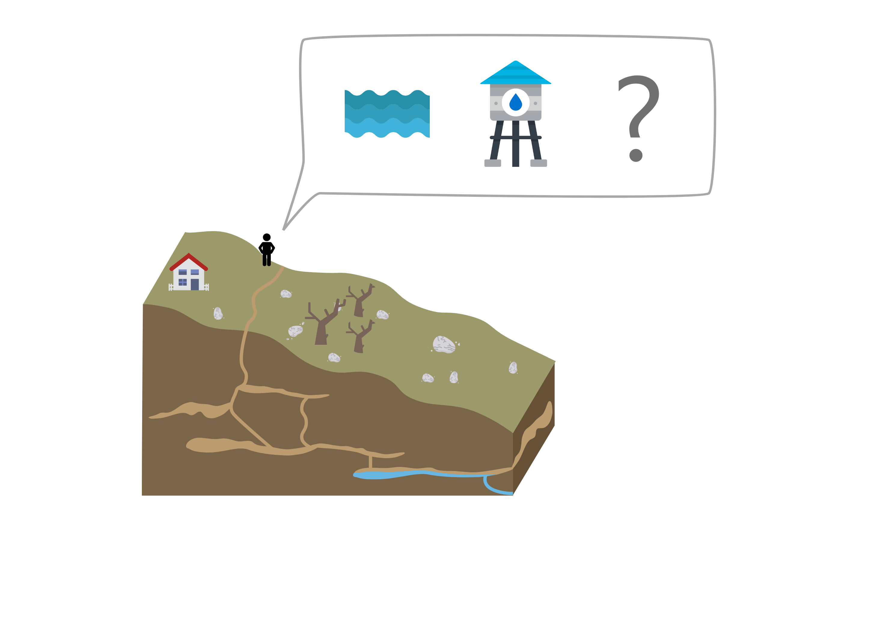

# Des pénuries ? 

##  ⛰️ Un exemple: le Doubs

 

> Massif du Jura, département du Doubs, automne 2018 : les municipalités en rouge ont été ravitaillées par camion citerne, celles en orange ont réussi à se brancher sur des réserves d'autres municipalités, les jaunes sont en tension.
*Source: Préfecture du Doubs* 

## ... mais aussi ailleurs

Alpes, Languedoc, Pyrénnés, ... les pénuries d'eau surviennent de plus en plus souvent. Les territoires s'étendent avec la montée des températures.

Pourquoi ? Ces municipalités sont sur des zones très dépendantes des sécheresses. L'eau n'y est pas retenue longtemps, car sont des zones de **relief** à roches **calcaire**. 

Voici le phénomène en image : 

 |  | 
------------ | ------------- | -------------
L'eau de pluie s'infiltre rapidement dans le sous-sol. Sur ces zones elle peut se déplacer jusqu'à 30 mètres par heure! |  Plus les sécheresses durent longtemps, plus les "rares" réserves s'épuisent (sources, rivières, forages,...) ou subissent des déficits. | Des déficits ou des pénuries d'eau potable peuvent survenir dans les semaines/mois qui suivent les sécheresses. 

## A l'avenir ? 

Les sécheresses seront plus intenses et plus longues et des sécheresses comme celles de 2018 deviendront même l'état commun à partir d'une certaine période.  Vous allez même apprendre à définir pour votre commune la durée et l'intensité des sécheresses. Pour vous donner une idée la hausse des températures sera d'environ 2°C, d'ici 30 ans. 

**Pour le voir à l'oeil nu: le nombre de journées d'été (>25°C) par an**

*Drias, données Météo-France, CERFACS, IPSL* / *Scénario sans politique climatique 8,5 / [Crédits et conditions d'utilisation](http://www.drias-climat.fr/accompagnement/conditions)*

**Quels impacts de la hausse des températures ?**
* 🌩Plus de précipiations intenses : la pluie tombe "d'un coup". Lorsque les pluies sont régulières environ 80% de la pluie entre dans le sol. S'il pleut d'un coup ça peut être moins de 50%. 
* 🌫 Evaporation
* 🥛 Augmentation du besoin en eau des plantes : les plantes utilisent plus d'eau au sol (de nombreux arbres peuvent boire 300L d'eau par jour !)
* ...

Bref: une des conséquences des sécheresses est que les réserves d'eau peuvent tarrir. 

# Un tutoriel en 3 temps

Vous pouvez évaluer le risque de pénurie d'eau potable dans votre commune (ou ailleurs) : 

1.OU | 2.QUAND | 3.COMMENT
 ------------ | ------------- | -------------
[Où résidez-vous ? Êtes vous sur un territoire très dépendant des sécheresses?](../eau-geologie-karstique) | [Quelle sera à l'avenir la durée et l'intensité des sécheresses que vous subirez sur votre territoire?](../indice-sswi) | [Des pénuries d'eau potable sont-elles possibles et sur combien de mois par an?](../eau-perrenite)
